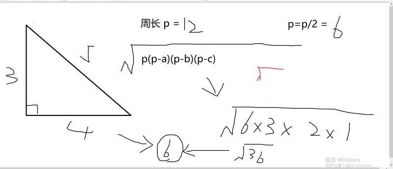
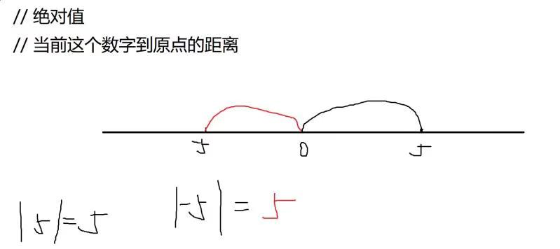

# 斐波那契数列
## 下面是标准版本——从第3项开始，第n项是前2项之和
1 1 2 3 5 8 13 21 34 55 89 ......
## n项是前2项之和+1
1 1 3 5 9 15 25......
# 等差数列
## 例如......
1 2 3 4 5 6 7 8 9 10......      公差1  
1 3 5 7 9 11 13 15 17......       公差2
## 等差数列求和公式
sum = (首项+末项)*项数/2
## 让你求第n项
1 5 9 13 17 21 25
## 首项a
## 末项b
a+0b   a+1b   a+2b   a+3b   ......   a+(n+1)b  
the 1st   the 2nd  the 3rd  the 4th   ........    the "n"th
# 等比数列
## 比 = 除以
a=5  
b=25  
a:b=5:25  
=1:5  
1 5 25 125 625.....  
## 公比=5
15:25——最大公因数=5，最小公倍数=75  
ab=(a,b)*[a,b]

# 绝对值——当前这个数字到原点的距离
# 组成三角形的条件
## 两边之和大于第三边or两边之差小于第三边
a+b>c   2边同时减去b  
a>c-b

# 相反数
## 相反数的结果=当前数字*(-1)
5の相反数=-5  
-3の相反数=3
## 负数——小于0的数字都是负数
-1>-5>-10>-100>-2233
## 正数——大于0的数都是正数
1<5<10<100<88888888666666
## 0——特殊判定
**零只会心疼giegie(doge**