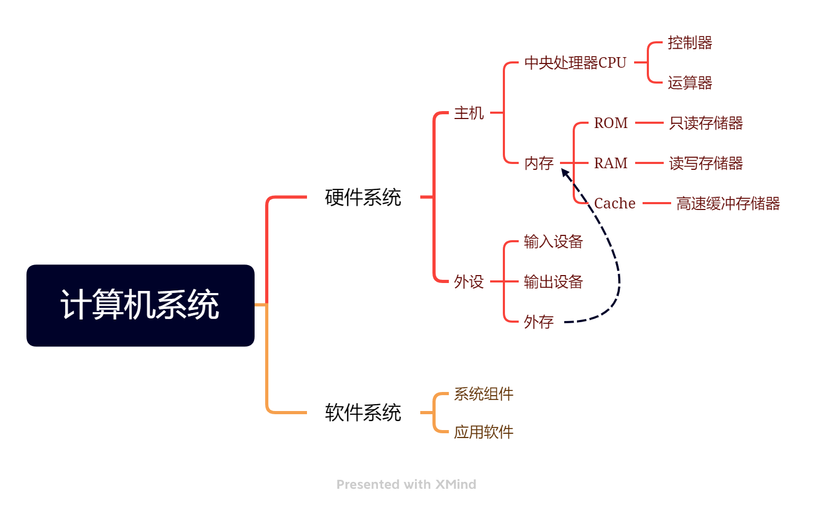
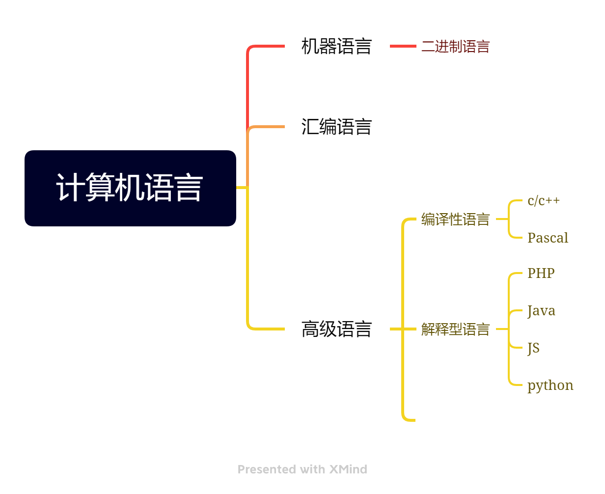

# 一些基础计算机知识
## 计算机の发展史
| 代系     | 组成器件 |
| ----------- | :----: |
| 第一代      | 电子管      |
|第二代  | 晶体管        |
|第三代|集成电路|
|第四代|大/超大规模集成电路|
## 现代计算机の父
### 冯·诺依曼
**美籍匈牙利**数学家**冯·诺依曼**提出计算机基本结构&工作方式の设想——冯·诺伊曼架构。
### 图灵
**英国人**。为人工智能提供了开创性の概念。提出“图灵测试”。图灵奖。
## 计算机系统

## 计算机存储单位
### 比特(bit)
1位二进制编码(0或1)
### 字节(B)
存储数据の基本单位
1字节 = 8bit
### 存储单位の换算
1TB = 1024GB
1GB = 1024MB
1MB = 1024KB
1KB = 1024B

PS:汉字占两个字节
## 数学知识——进制
2进制——取值范围:0,1
8进制——取值范围:0,1,2,3,4,5,6,7
16进制——取值范围:0,1,2,3,4,5,6,7,8,9,A,B,C,D,E,F

### 进制の+-法
### 进制转换
n进制————>10进制
#### 位权
个位*nの0次方+十位*nの1次方+百位*nの2次方......

#### 10进制—————>n进制
除n取余法——自下而上
#### 小数
n进制————>10进制
##### 位权
小数点后第一位*nの-1次方+小数点后第二位*nの-2次方
##### 10进制—————>n进制
乘n取整法——自上而下
## 计算机语言

## 计算机知识——原码，反码和补码
### 对于正数
它们全部一样
### 对于负数
符号位**万年为1**，后面想咋变咋变
#### eg:
原码 **1**11011    
反码 **1**00100 
~~~markdown
除了符号位，0变1，1变0
~~~
补码 **1**00101
~~~markdown
反码+1
~~~
# 网络
## IP地址分五类
| 类别    | 第一段の范围 |
| ----------- | :----: |
| A     | 1-127     |
|B  | 128-191       |
|C|192-223|
|D|不常用，不记|
|E|不常用，不记|
### IPv4/v6
IPv4 —— 32位二进制数码
IPv6 —— 64为二进制数码
## 域名
国家顶级域名:cn(中国),us(美国),uk(英国)
商用顶级域名:com(企业),edu(教育),gov(政府),org(组织)
## 邮件协议
SMTP 发邮件
POP3 收邮件
IMAP 访问协议
## 排序方法
冒泡排序 稳定
插入排序 稳定
归并排序 稳定
**慢**
## 奇巧淫技
### 左移
#### n<<m —— n转为2进制向左移动m位 —— 相当于 n * 2 のm次方
~~~c++
cout << (10<<3) << endl;
~~~
#### n>>m —— n转为2进制向右移动m位 —— 相当于 n / 2 のm次方
~~~c++
cout << (10>>2) << endl;
~~~
#### & 按位与 ———— 转为2进制，有0就0，全1为1
~~~c++
cout << (3&5) << endl;
~~~
#### & 按位或 ———— 转为2进制，有1就1，全0为0
~~~c++
cout << (3|5) << endl;
~~~
#### ^  按位与 ———— 转为2进制，不同为1，相同为0
~~~c++
cout << (3 ^ 5) << endl;
~~~